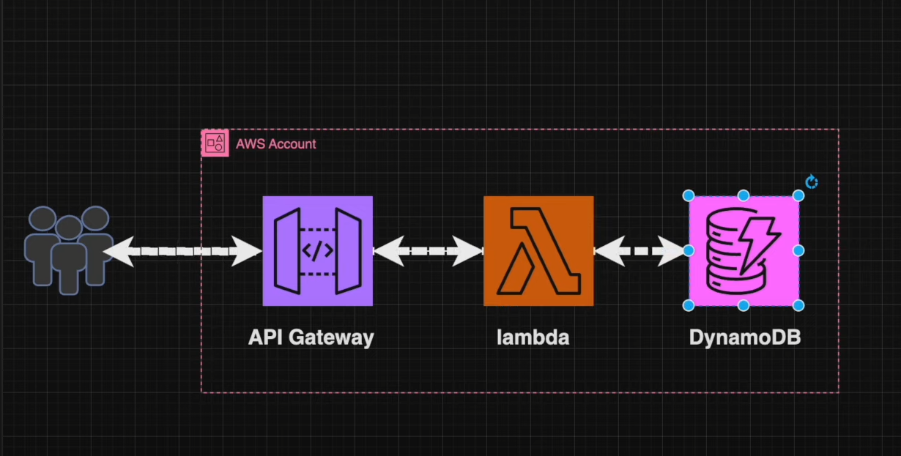

This is a Project in which a serverless application in deployed on cloud .

# Serverless Application on AWS

This repository contains a serverless application built on AWS, utilizing **API Gateway**, **AWS Lambda**, and **DynamoDB**. The project demonstrates how to create a simple web form that submits data to a backend API, which then processes and stores the data in a DynamoDB table.

## Table of Contents

- [Architecture Overview](#architecture-overview)
- [Screenshots](#screenshots)
- [Setup Instructions](#setup-instructions)
- [Testing](#testing)

## Architecture Overview

This serverless architecture consists of the following components:

- **API Gateway**: Exposes a RESTful API to accept HTTP requests.
- **AWS Lambda**: Handles the logic to process the incoming requests and interacts with DynamoDB.
- **DynamoDB**: Stores the data submitted through the web form.

## Screenshots

### Frontend Form

The frontend is a simple HTML form that captures user inputs like name, email, and a message. This data is then sent to the API Gateway.

### DynamoDB Table

Submitted form data is stored in a DynamoDB table. The table below shows how the data appears in DynamoDB.

## Setup Instructions

### Prerequisites

- An AWS account
- AWS CLI configured with appropriate permissions
- Node.js installed (optional for frontend development)

